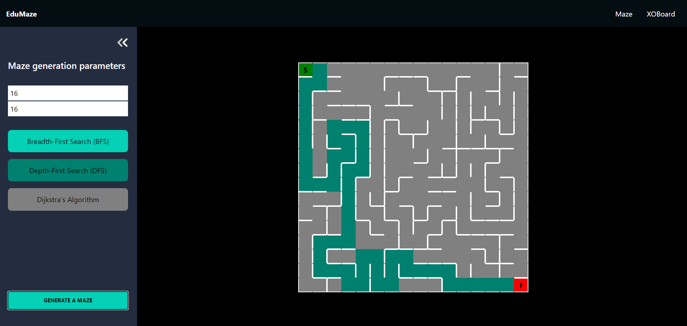
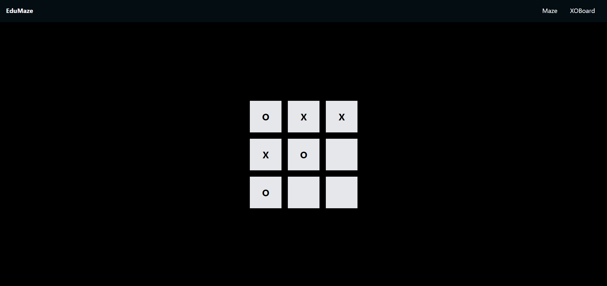

# EduMaze Frontend

EduMaze Frontend is a React-based user interface for the EduMaze project. It demonstrates various algorithms including maze solving algorithms (BFS, DFS) and the game of Tic-Tac-Toe with an AI opponent.





### Description of Main Files

#### 1. `src/index.js`

This file is the entry point of the React application. It renders the root component (`App`) into the DOM.

#### 2. `src/App.js`

This file defines the main routing of the application. It sets up routes for the home page, the maze page, and the Tic-Tac-Toe page.

#### 3. `src/pages/XOBoard.jsx`

This file contains the logic and UI for the Tic-Tac-Toe game, including handling player moves and updating the game state based on the server response.

#### 4. `src/pages/Maze.jsx`

This file contains the logic and UI for generating and displaying the maze based on user input and server response.

#### 5. `src/pages/Home.jsx`

This file contains the UI for the home page of the application.

#### 6. `src/components/XOBoardComponents/GameInfoModal.jsx`

This file contains the modal component displayed at the end of a Tic-Tac-Toe game, showing the result and offering to start a new game.

#### 7. `src/components/MazeComponents/MazeSettingsPanel.jsx`

This file contains the settings panel component for the maze generation page, allowing the user to input maze parameters and select the algorithm.

#### 8. `src/hook/useReactToastify.jsx`

This file contains a custom hook for displaying toast notifications using `react-toastify`.

### Getting Started

#### Prerequisites

- Node.js
- npm or yarn

#### Installation

1. Clone the repository:

2. Install the dependencies:

   ```sh
   npm install
   # or
   yarn install
   ```

3. Start the development server:
   ```sh
   npm start
   # or
   yarn start
   ```

The application should now be running at `http://localhost:3000`.

### Usage

#### Navigating the Application

- **Home Page:** Provides an entry point to navigate to either the maze generation page or the Tic-Tac-Toe game page.
- **Maze Page:** Allows users to input maze dimensions and select an algorithm (BFS or DFS) to generate and display a maze.
- **Tic-Tac-Toe Page:** Allows users to play a game of Tic-Tac-Toe against an AI opponent. The game state is managed and updated based on server responses.

### Contributing

Contributions are welcome! Please open an issue or submit a pull request for any improvements or bug fixes.

### License

This project is licensed under the MIT License.
